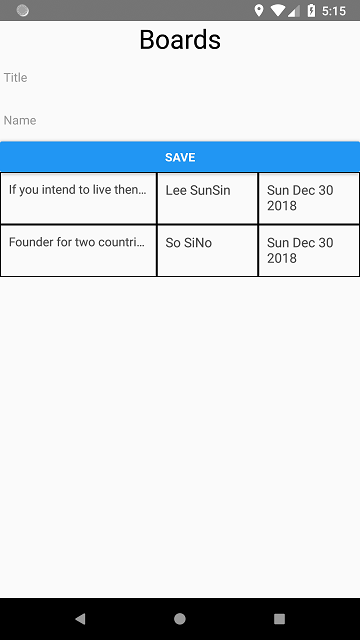

## simple board(CRUD) examples for React-Native ##

This example is boards focusing on data input / output for easy understanding of React-Native.

This app has been tested only on Android.

### Branches ###
- master: Implement input screen and list in one activity
- modal: Implement input screen in modal
- redux: React-Native + Redux

### Install & Run ###
- git clone https://github.com/gujc71/rn_board.git
- react-native run-android (or react-native run-ios)

